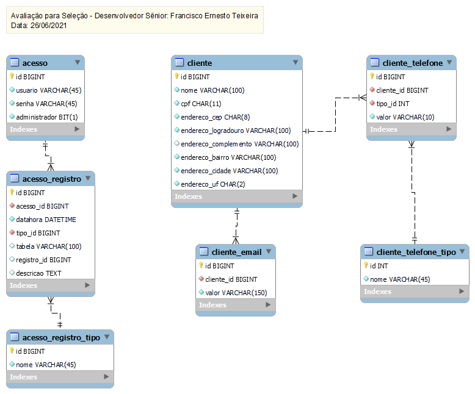

# Avaliação para Seleção - Desenvolvedor Sênior

Projeto de CRUD de Cliente solicitado para a avaliação de seleção para desenvolvedor sênior.

Repositório referente ao banco de dados.

O projeto completo pode ser acessado a partir do [repositório principal](https://github.com/netinhoteixeira/avaliacao-selecao-desenvolvedor-senior).

## Detalhes

O banco de dados escolhido foi o MySQL na versão disponibilizada pela [Percona](https://www.percona.com/).

Para cachê da pesquisa a ser realizada no serviço [ViaCEP](https://viacep.com.br/) é utilizado o banco de dados [Redis](https://redis.io/).

Ambos os bancos de dados estão contenerizados utilizando o [Docker Desktop](#docker-desktop) com o objetivo de auxiliar e agilizar no desenvolvimento da solução para o problema exposto.

A modelagem dos dados utiliza das boas práticas de referenciamento e atende às necessidades básicas de integridade e quarta forma da normalização.

Sugestões são bem vindas.

### Diagrama da Base de Dados Avaliação

## Ferramentas

O diagrama e documentação da base de dados foi elaborada e está sendo mantida utilizando a ferramenta [MySQL Workbench](#mysql-workbench).

### MySQL Workbench

O MySQL Workbench pode ser obtido no seguinte endereço: https://www.mysql.com/products/workbench/

### Docker Desktop

O Docker Desktop pode ser obtido no seguinte endereço: https://www.docker.com/products/docker-desktop
